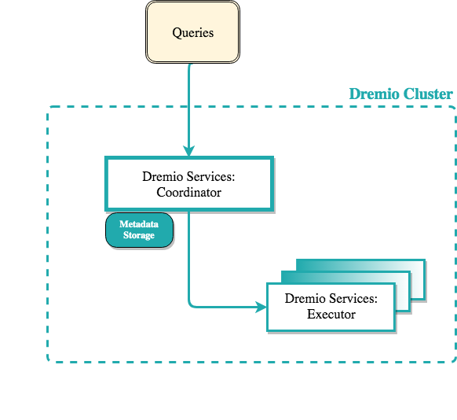
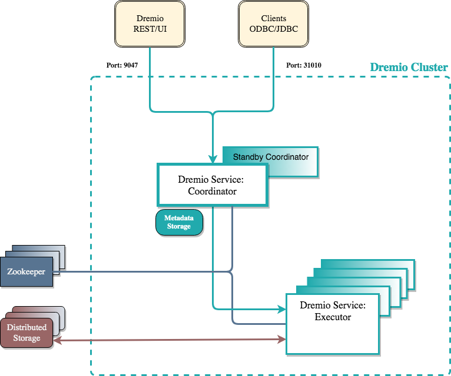

# Running Dremio with Docker

This repository contains configuration files for deploying Dremio with Docker on different architectures.

## Running standalone architecture
At standalone dir, execute the command below:

```
  docker-compose up -d 
``` 
  

## Running cluster with zookeeper embedded
This example run one master coordinator and two executor nodes


#### Configure users and permissions
Before start containers, set appropriated users and permissions:
```
  sudo groupadd -g 999 dremio
  sudo useradd dremio -u 999 -g 999
  sudo chown dremio:dremio metadata
```
#### Starting the containers
At cluster-1 dir, execute the command below:
```
  docker-compose up -d 
``` 

You can now navigate to the Dremio UI at <a href="http://localhost:9047">http://localhost:9047</a>

## Running High Availability cluster
TODO

